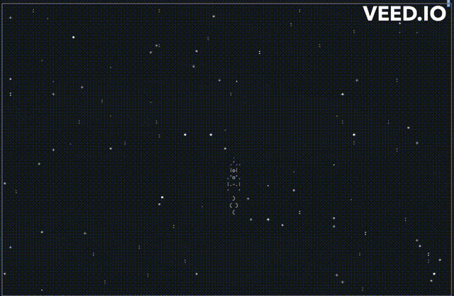

# Космическая игра

Игра в терминале которая позволяет управлять космическим кораблем на фоне мерцающих звезд.

## Запуск

Для запуска блога у вас уже должен быть установлен Python 3.
(Желательно Python версии 3.7, чтобы избежать проблем с совместимостью)

- Скачайте код
- Установите зависимости командой `pip install -r requirements.txt`
- Запустите в терминале команду `python3 main.py`

